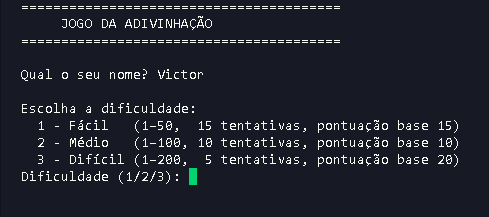
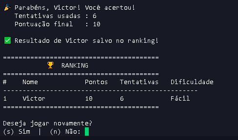

# Jogo da Adivinhação 🎯

Um jogo simples em Python onde você tenta descobrir um número secreto. Tem níveis de dificuldade, sistema de pontos e um ranking pra ver quem manda melhor.

---

## Funcionalidades ⚙️

- 3 níveis de dificuldade:
  - Fácil: 1–50 (15 tentativas)
  - Médio: 1–100 (10 tentativas)
  - Difícil: 1–200 (5 tentativas)
- Dicas a cada tentativa (maior ou menor)
- Sistema de pontuação (errou, perdeu ponto)
- Ranking com os melhores jogadores

---

## Tecnologias 💻

- Python 3  
- Programação Orientada a Objetos (POO)  
- Classe abstrata (`ABC`)  

---

## Como executar ▶️

python nome_do_arquivo.py

Como jogar 🎮
 - Digite seu nome
 - Escolha a dificuldade
 - Tente acertar o número
 - Use as dicas pra chegar lá
 - Veja sua pontuação no ranking

---

Pontuação 📊
 - Começa com um valor baseado na dificuldade
 - Cada erro tira 1 ponto
 - Se perder, zera

Ranking:

 - Mais pontos = melhor
 - Menos tentativas = desempate

---

## Como baixar e executar 🚀

1. Baixe o projeto  
   - Clique no botão verde **Code** no GitHub  
   - Depois em **Download ZIP**  
   - Extraia a pasta no seu computador  

2. Abra a pasta do projeto  
   - Entre na pasta onde está o arquivo `.py`

3. Abra o terminal  
   - Clique com o botão direito dentro da pasta  
   - Selecione **Abrir no terminal** (ou PowerShell)

4. Execute o jogo  

adivinhacao.py

Estrutura 🧠
 - Jogo: classe base
 - JogoAdivinhacao: lógica principal
 - ranking: guarda os jogadores
 - main(): roda o jogo

---

Observações 📌
 - O ranking não é salvo (fechou, perdeu)
 - Projeto feito pra treinar lógica e POO

